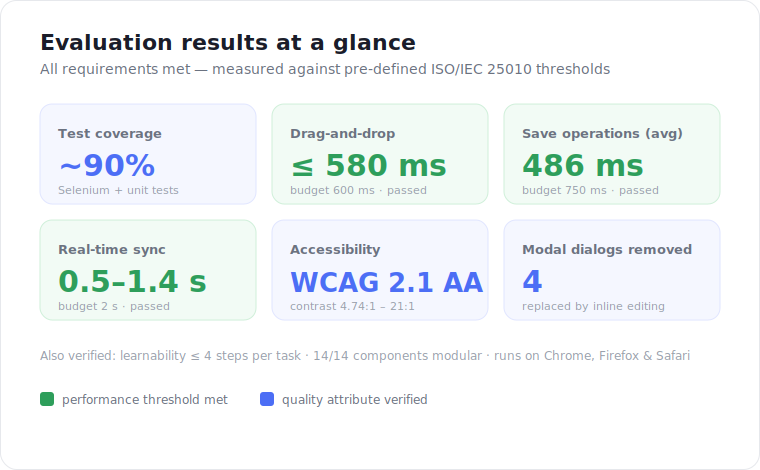
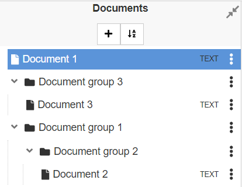
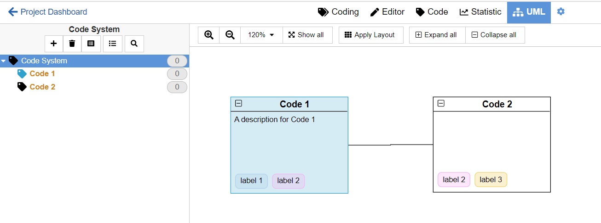
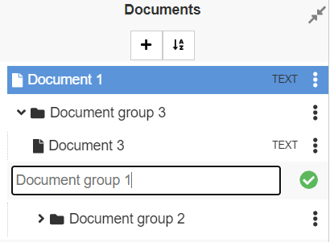
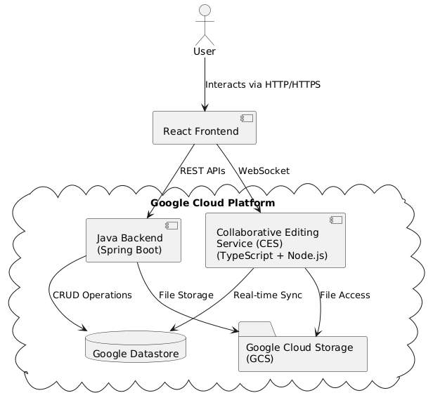

# Improving the User Experience of the QDAcity Coding Editor

**MSc thesis — mixed-methods UX research and fullstack product engineering on [QDAcity](https://qdacity.com), a cloud-based Qualitative Data Analysis (QDA) platform used by academic researchers.**

> **Role:** Researcher & Fullstack Developer (solo MSc thesis) · **Institution:** MSc in Artificial Intelligence, Friedrich-Alexander-Universität Erlangen-Nürnberg · **Live system:** [qdacity.com](https://qdacity.com)
<!-- TODO (Bahareh): add submission date and grade if you'd like them shown. -->

---

## TL;DR

- **Problem.** QDAcity's coding editor — the workspace where non-technical academics tag and analyse documents — had three usability gaps: no way to organise documents, a UML-based code visualisation too complex for its users, and a modal-heavy workflow that broke researchers' flow.
- **Approach.** I grounded the work in established HCI theory (Information Architecture, User-Centered Design, affordances), turned it into a formal specification of functional and non-functional requirements against the **ISO/IEC 25010** quality model, then designed, built, and rigorously evaluated three features.
- **Result.** Every requirement was met. Highlights: **~90% test coverage**, drag-and-drop responses **≤ 580 ms** (budget 600), saves averaging **486 ms** (budget 750), real-time sync in **0.5–1.4 s** (budget 2 s), full **WCAG 2.1 AA** compliance, and **4 modal dialogs eliminated**.

---

## Context

**Qualitative Data Analysis (QDA)** is how researchers make sense of unstructured material such as interviews and transcripts: they *code* it, tagging passages with concepts to surface themes and build theory. [QDAcity](https://qdacity.com) is a cloud platform that supports this, and its **coding editor** is where researchers spend most of their time — so the editor's usability directly shapes how productive a research project can be.

The platform's core users are **non-technical academics**. As QDAcity grew, the editor accumulated friction that hurt exactly those users. My thesis set out to find where that friction actually lived, fix the parts that mattered most, and prove the fixes worked against measurable criteria.

## The problem

A review of the literature plus an audit of the existing editor converged on three concrete gaps:

1. **No document organisation.** Users could not even create folders. Documents lived in a flat list that did not scale to real projects spanning many sources, participants, or analysis stages.
2. **An over-complex code visualisation.** The "Codemap" was built on a UML-style meta-model — the *Codesystem Language* (CSL), with **21 entity types and 20 relationship types** — that assumed object-oriented literacy. Powerful for technical users, a steep wall for everyone else.
3. **A modal-heavy workflow.** Routine actions (rename, create) constantly threw the user into modal dialogs, interrupting the coding flow and adding cognitive load.

## Approach

Rather than redesign by intuition, I worked top-down from theory to measurement:

- **HCI grounding.** Decisions were anchored in **Information Architecture**, **User-Centered Design**, and **affordances**, aligned with the ISO 9241-210 usability standard. Concrete tactics included tooltips, info icons, visual consistency, and inline editing.
- **A formal specification.** I expressed the work as **Functional Requirements** (document groups, Codemap, labels, shared UX) and **Non-Functional Requirements** derived from the **ISO/IEC 25010 (SQuaRE)** quality model — usability, performance, compatibility, maintainability, real-time collaboration, and visual feedback — each with a *measurable* acceptance threshold.
- **Validation built in from the start.** Every requirement had an evaluation method attached: Selenium acceptance tests, backend unit tests, Nielsen heuristic evaluation, Chrome DevTools performance profiling, and WebAIM contrast checking.

## What I built

### 1. Hierarchical document groups

Nested document groups with **drag-and-drop reorganisation**, auto-expand-on-drop to keep users oriented, real-time collaborative structure edits, and a delete flow that lets users choose to remove contents *or* move them elsewhere.

**Engineering decision worth highlighting.** The hierarchy is stored with the **Adjacency List** pattern (each group holds a nullable `parentId`) on **Google Datastore (NoSQL)**. I chose it over two alternatives, and the reasoning maps directly to the *workflow* rather than abstract elegance:

| Approach | Reorganise (drag-and-drop) | Verdict |
|---|---|---|
| **Adjacency List** (chosen) | **O(1)** | Cheap moves — fits a reorg-heavy workflow |
| Nested Set Model | O(n) — recompute bounds on every move | Rejected: optimises subtree reads we rarely need |
| Composite Pattern | O(k), needs app-wide refactor | Rejected: documents and groups aren't uniform; refactor cost too high |

<!-- Screenshot from thesis: resources/document_group_ui.png  →  save as assets/document-groups.png -->
<!--  -->

### 2. Simplified Codemap

I removed the CSL meta-model **entirely** and replaced it with a plain **node–edge** model: nodes *are* codes, edges *are* user-defined relationships. No meta-model to learn. Nodes support shape, border, colour, description, resize, and reusable project-wide **labels** (synced as **CRDTs**); edges support labels, line/arrow styles, and colour; everything auto-saves.

I kept **mxGraph** as the rendering library (over D3.js) for compatibility with the existing codebase and its built-in graph-editing — a deliberate, documented trade-off, since mxGraph has been unmaintained since 2020 but replacing it was out of scope for the thesis.

<!-- Screenshot from thesis: resources/codemap_ui.png  →  save as assets/codemap.png -->
<!--  -->

### 3. Inline editing (Direct Manipulation)

Following Shneiderman's **Direct Manipulation** principle, I replaced modal dialogs with **edit-in-place**: click to edit, **Enter** to confirm, **Esc** to cancel — consistent across documents, groups, codes, and labels, via a reusable `NewItemInput` component. This **eliminated 4 modal dialogs** and kept users in their flow.

<!-- Screenshot from thesis: resources/inline_editing_ui.png  →  save as assets/inline-editing.png -->
<!--  -->

## Architecture

A client–server system: a **React** frontend talks to a **Java / Spring Boot** backend over REST (business logic, persistence via a **DAO** layer over Datastore, files in **Cloud Storage**), and to a separate **TypeScript / Node.js** Collaborative Editing Service over WebSockets for real-time sync (powered by **y.js** CRDTs). The Java backend runs on **Google App Engine**; the collaboration service runs on **Cloud Run** (App Engine Standard doesn't support WebSockets).

<!-- Diagram from thesis: resources/architecture_diagram_V3.png  →  save as assets/architecture.png -->
<!--  -->

## Results

All functional requirements were validated through **Selenium acceptance tests and unit tests at ~90% coverage**, and **every non-functional requirement was met**. The measured results:

**Performance — responsiveness** (budget ≤ 600 ms, drop → visual update, avg of 10 runs):

| Operation | Result |
|---|---|
| Drag a code onto the Codemap | 380.1 ms |
| Drag a document into a group | 532.2 ms |
| Move a node within the Codemap | 580.0 ms |

**Performance — save operations** (budget ≤ 750 ms): overall average **485.7 ms**, ranging from 429 ms (create label) to 590 ms (delete group).

**Real-time collaboration** (budget ≤ 2 s, 3 concurrent users): document-group changes propagated in **1.42 s**, Codemap changes in **0.52 s**.

**Accessibility (WCAG 2.1 AA):** every UI element exceeded the 4.5:1 contrast minimum, measured from **4.74:1 to 21.01:1**.

**Learnability:** all core tasks completable in **≤ 4 steps** (Nielsen "Help and Documentation" heuristic).

**Maintainability:** 14/14 reviewed components passed single-responsibility and documentation checks; backend **100% unit-test coverage**, frontend **80%** Selenium scenario coverage.

**Compatibility:** verified on Chrome, Firefox, and Safari (2024+ versions).

## Tech stack

**Frontend:** React.js · styled-components · mxGraph · y.js
**Backend:** Java / Spring Boot (REST, DAO) · TypeScript / Node.js (Collaborative Editing Service)
**Data & infra:** Google Cloud Platform — App Engine · Cloud Run · Cloud Storage · Datastore (NoSQL)
**Quality:** Selenium acceptance tests · unit tests · Nielsen heuristic evaluation · Chrome DevTools profiling · WCAG 2.1 AA

## What I learned

- **UX decisions are often data-model decisions.** "Let users nest documents" became "pick a tree-storage pattern on NoSQL." Following a user need all the way to the schema — and choosing the adjacency list because the *workflow* is reorganisation-heavy — was the most useful lesson.
- **Specifying success up front makes it real.** Writing measurable NFRs before building turned "feels faster" into "≤ 600 ms, verified over 10 runs," and kept scope honest.
- **Removing complexity beats adding features.** The Codemap win came from deleting a 21-entity meta-model, not from new capability.
- **Name your trade-offs.** Keeping an unmaintained library (mxGraph) was the right call under thesis constraints — but only because the risk was explicit and justified.

## Future work

The thesis outlines three extensions: a **recommendation mode** for the Codemap (collaborative node/edge suggestions), **advanced filtering** of the code system (multi-criteria and saved filters), and a granular **undo/redo** system across the editor.

## The full thesis

The complete thesis is included in this repository and is licensed **CC BY 4.0**, so you're free to read and share it with attribution.

<!-- TODO (Bahareh): drop your compiled PDF in as thesis.pdf and uncomment the line below. -->
<!-- 📄 [Read the full thesis (PDF)](thesis.pdf) -->

---

Case study by Bahareh ChalayAmoly · MSc Artificial Intelligence, FAU Erlangen-Nürnberg · [LinkedIn](https://www.linkedin.com) <!-- TODO: paste your real LinkedIn URL -->
